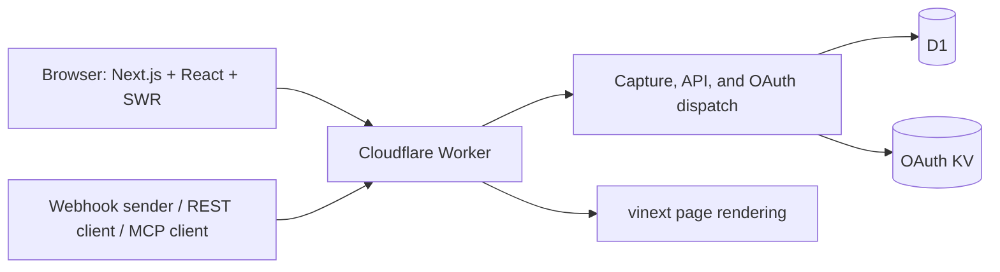

# Freebin web application

This directory contains the Next.js App Router frontend and Cloudflare Worker backend. React and SWR provide client navigation, session state, and page data. The Worker handles request capture, REST APIs, OAuth/MCP, and page rendering; D1 stores application data and KV stores OAuth state.

The Cloudflare build uses vinext. `npm run build:native` checks frontend compatibility with native Next.js; the Worker backend is provided by `worker.js`. Dependencies and versions are pinned in [package.json](package.json) and [package-lock.json](package-lock.json).

## Local development

From the repository root:

```bash
cd src/site
npm ci
npm run db:migrate:local
npm run demo:create
npm run dev -- --port 8788
```

Open [http://localhost:8788](http://localhost:8788). Registration is enabled locally. D1 and KV are simulated with persistent data in `.wrangler/state`; deployment credentials are not required.

For a compiled Worker preview, stop the development server on that port and run:

```bash
npm run build
npm run start -- --port 8788
```

Development, local migrations, demo seeding, and preview use the same persistence directory. The Docker environment uses `/data` inside its named volume instead. See the [repository README](../../README.md) for Docker and root command shortcuts.

## Architecture



| Location                                    | Responsibility                                                                                 |
| ------------------------------------------- | ---------------------------------------------------------------------------------------------- |
| [app/](app/)                                | App Router entries, root layout, metadata, and loading/error boundaries.                       |
| [components/](components/)                  | React screens, interaction state, and scoped styles.                                           |
| [AppShell.tsx](components/AppShell.tsx)     | Shared navigation and SWR session state; clears private caches after session changes.          |
| [PageLoader.tsx](components/PageLoader.tsx) | Fetches page data from `/api/ui/page` and handles loading, errors, and redirects.              |
| [server/](server/)                          | API routes, page loaders, authorization, storage, forwarding, retention, audit, and telemetry. |
| [worker.js](worker.js)                      | OAuth provider, trusted MCP identity handoff, application dispatch, and rendering.             |
| [migrations/](migrations/)                  | D1 schema and migration history.                                                               |
| [public/](public/)                          | CLI, OpenAPI contract, configuration schema, and static assets.                                |
| [examples/](examples/)                      | JavaScript and Python integrations.                                                            |

Internal links and programmatic navigation use Next.js routing. The browser fetches page data from the same origin through SWR. Capture endpoints, SSE streams, cookie handling, and resource bindings run in the Worker.

## Routes and contracts

| Route                                          | Purpose                                                                                                  |
| ---------------------------------------------- | -------------------------------------------------------------------------------------------------------- |
| `/`, `/docs`, `/terms`                         | Homepage, developer documentation, and terms.                                                            |
| `/account`                                     | Authentication, bins, API keys, collaboration, and account deletion.                                     |
| `/bin/:id`                                     | Live request inspection, filters, exports, replay, forwarding, rules, configuration, sharing, and audit. |
| `/demo`                                        | The bin inspector with redacted public demo data and disabled actions and mutations.                     |
| `/shared/bin/:token`, `/shared/request/:token` | Revocable read-only views.                                                                               |
| `/admin`                                       | Admin-only service totals, recent users, and Engram reports.                                             |
| `/b/:id/*`                                     | Request capture with an owner API key.                                                                   |
| `/api/v1/*`                                    | REST management API; see the [OpenAPI contract](public/openapi.yaml).                                    |
| `/api/ui/layout`, `/api/ui/page`               | Session-aware frontend bootstrap data.                                                                   |
| `/mcp`, `/oauth/*`, `/.well-known/*`           | MCP tools, OAuth discovery, consent, token management, and revocation.                                   |
| `/freebin.mjs`, `/openapi.yaml`, `/schemas/*`  | Downloadable CLI and API/configuration contracts.                                                        |

Backend operations enforce ownership and collaboration permissions. User, share, API, and consent responses use `private, no-store`. Public share responses omit source addresses. Inspector capability links exchange their token for an HttpOnly, Secure, SameSite cookie and remove the token from the URL.

Replay and forwarding use a public HTTPS destination policy and strip sensitive and propagation headers. Configure `REPLAY_ALLOWED_ORIGINS` for your deployment. The public demo credential cannot authorize account operations.

## Testing

Run these from this directory:

```bash
npm run types
npm run check
npm test
npm run build:native
npm run build
npm run db:migrate:local
npm run demo:create
npx playwright install chromium
npm run test:e2e
npm run test:admin
npm run deploy:dry-run
```

`npm run check` validates application sources independently of generated `.next` validators. The native Next.js build checks its own generated route types. The Worker build packages the application for Cloudflare.

Browser tests create synthetic accounts and captures in local D1. The main suite uses port 8788 and can reuse a running preview; `FREEBIN_TEST_URL` selects another test instance. Use a test database. `npm run test:admin` starts a separate local Worker on port 8790 with a synthetic admin allowlist and checks authorization, report controls, download, mobile layout, and logout.

Browser reports are written to `playwright-report/`, traces to `test-results/`, and screenshots to `artifacts/`. [GitHub CI](../../.github/workflows/pr-ci.yml) runs these checks and retains browser evidence. Run `npm audit` when reviewing dependency changes.

## Deploy to Cloudflare

Run the following from `src/site`. Create `.env` from the [example](.env.example) if it does not already exist:

```bash
cp -n .env.example .env
```

For initial resource creation, authenticate Wrangler and create a D1 database and OAuth KV namespace, or use resource IDs from your Cloudflare dashboard:

```bash
npx wrangler login
npx wrangler d1 create freebin-db
npx wrangler kv namespace create OAUTH_KV
```

Set the returned IDs and application settings in `.env`:

| Setting                                          | Purpose                                                                                                         |
| ------------------------------------------------ | --------------------------------------------------------------------------------------------------------------- |
| `CLOUDFLARE_ACCOUNT_ID`, `CLOUDFLARE_API_TOKEN`  | Authenticate deployment and remote management scripts; optional with Wrangler login or shell/CI authentication. |
| `D1_DATABASE_ID`                                 | D1 database bound as `DB`. Required for a real deployment.                                                      |
| `OAUTH_KV_ID`                                    | KV namespace bound as `OAUTH_KV`. Required for a real deployment.                                               |
| `WORKER_NAME`                                    | Worker name; defaults to `freebin-next`.                                                                        |
| `WORKER_DOMAINS`                                 | Optional comma-separated custom hostnames. Leave empty to use `workers.dev`.                                    |
| `RATE_LIMIT_SALT`                                | Required server secret with at least 32 characters. Use a unique random value.                                  |
| `SIGNUPS_ENABLED`                                | Registration policy; deployment defaults to `false`.                                                            |
| `ADMIN_EMAILS`                                   | Comma-separated admin email allowlist.                                                                          |
| `DEPLOYMENT_ENVIRONMENT`                         | Telemetry environment label; deployment defaults to `production`.                                               |
| `REPLAY_ALLOWED_ORIGINS`                         | Outbound replay and forwarding allowlist.                                                                       |
| `DEMO_BIN_ID`, `DEMO_API_KEY`, `DEMO_*_LIMIT_*`  | Public demo identity and capture quotas; see `.env.example` for exact names.                                    |
| `RUM_SCRIPT_URL`, `RUM_APP_NAME`                 | Optional Corridora browser telemetry script and service name.                                                   |
| `OTEL_EXPORTER_OTLP_ENDPOINT`, `OTEL_SERVER_KEY` | Optional server telemetry endpoint and ingest secret.                                                           |

Deployment scripts resolve `.env` from this directory regardless of the caller's working directory. File values override shell/CI values, including explicit empty values; absent keys fall back to the environment. Cloudflare credentials are passed to Wrangler and excluded from Worker variables and application secrets. Keep `.env` out of version control.

After configuration, apply migrations, check packaging, and deploy:

```bash
npm run db:migrate:remote
npm run deploy:dry-run
npm run deploy
```

`npm run deploy` builds the Worker, generates production configuration, and uploads the supported secrets using a temporary file removed after the command. Dry runs use placeholder resource IDs when needed and do not upload code. Remote migrations are a separate operation; deployment does not seed or reset the database. Preserve D1 migration records and back up existing data before applying changes to a production instance.

To initialize synthetic public demo samples, run `npm run demo:create:remote` separately. `npm run config:push` updates the supported secrets on an existing Worker. These commands target the resource IDs in `.env`.

Platform references: [Cloudflare Next.js guide](https://developers.cloudflare.com/workers/framework-guides/web-apps/nextjs/), [Wrangler configuration](https://developers.cloudflare.com/workers/wrangler/configuration/), and [Worker secrets](https://developers.cloudflare.com/workers/configuration/secrets/).

## Admin access and Engram reports

The service overview includes the Cloudflare Worker version ID, optional version tag, and upload time. Production builds configure a link to the Worker's Deployments dashboard from `CLOUDFLARE_ACCOUNT_ID` and `WORKER_NAME`. Local previews display a local-development status instead of a deployment version.

Sign in with an email listed in the Worker's `ADMIN_EMAILS` and open `/admin`. To enable a local admin on the compiled preview:

```bash
npm run start -- --port 8788 --var ADMIN_EMAILS:developer@example.com
```

For Cloudflare deployments, set `ADMIN_EMAILS` in `.env`. The admin page exposes service totals, recent accounts, and an application graph report with interactive cluster and node relationship graphs, search, cluster filters, relationship inspection, and JSON download. Graph controls support mouse and keyboard selection. The node visualization shows up to 60 matching nodes, prioritizing the selected node and its neighbors; the table retains the full dataset. The cluster visualization shows the 36 largest clusters. The backend checks the session and allowlist before returning report data.

Builds and development startup create a report snapshot from the repository's `.engram/graph.json`. The snapshot uses application paths and omits hidden files, runtime type declarations, dependencies, build output, its generated JSON, and relationships outside that scope. A missing graph shows an empty state; a source graph marked stale shows a warning. The report is served through authorized page data rather than public assets.

After refreshing the graph, run `npm run engram:snapshot` to update the local snapshot, or rebuild for deployment. Cloudflare serves the snapshot included in that build. Snapshot timestamps and a source digest identify the graph input.

GitHub Actions runs on pull requests, pushes to `main`, and manual dispatch. It installs the locked root Engram dependency and runs `npm run engram:build` from the repository root before the site checks and builds. This performs headless code extraction without an LLM key and writes `src/site/artifacts/engram/graph.json` and `GRAPH_REPORT.md`, preserving the developer's `.engram/` graph. Generated types, snapshots, browser reports, test results, coverage, dependencies, and build artifacts are excluded. The workflow uploads the graph, report, and sanitized admin snapshot as the `engram-graph` artifact.

CI sets `ENGRAM_DIRECTORY` to that generated artifact directory for all subsequent snapshots and requires a non-empty application graph with `ENGRAM_REQUIRED=true`. For the same local build, run `npm ci` and `npm run engram:build` at the repository root, then `ENGRAM_DIRECTORY="$PWD/src/site/artifacts/engram" ENGRAM_REQUIRED=true npm run build`. These graphs represent code structure; semantic document extraction and assistant descriptions remain part of the interactive Engram workflow.

## Performance profiling

Start a compiled local preview, then run:

```bash
npm run baseline
```

The recorder creates 100 synthetic captures with 8 KiB padding, takes three navigation samples at 4× CPU throttling, and records search timings, DOM counts, list payload bytes, and asset gzip sizes. Results go to `artifacts/baseline/manifest.json` and screenshots in the same directory. The recorder accepts only local hosts.

Compare runs using the same workload, browser, CPU throttling, and cache conditions. The search measurement includes automation and animation frames; it is not INP. Local synthetic navigation results do not replace production Core Web Vitals or RUM. Inspector work affects full-list downloads, React payload filtering, and list refreshes after SSE events, so record both network and interaction behavior when changing those paths.

For changes to API contracts, authorization, or capture behavior, follow the [contribution checklist](../../CONTRIBUTING.md#before-opening-a-pull-request).
